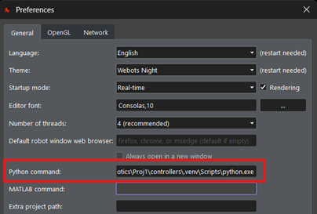

# Robotics Project

This project uses Webots and a genetic algorithm to train robotic controllers. Follow the steps below to set up the environment and run the tests.

## 📁 Project Structure

```
Robotics/
├── Proj1/
│   ├── controllers/
│   │   ├── p1_controller_train/
│   │   ├── p1_controller_test/
|   |   ├── p1_util/
|   |   ├── real_thymio_interaction/
|   |   ├── thymio_rl_controller/
│   │   └── requirements.txt
```

## ⚙️ Project Setup

### 🛠️ 1. Create Virtual Environment

Navigate to the controllers folder:
```bash
cd [path]\Robotics\Proj1\controllers
python -m venv .venv
```

### ⚙️ 2. Activate Virtual Environment and Install Dependencies

**Windows (PowerShell):**
```bash
.venv\Scripts\Activate.ps1
pip install -r requirements.txt
```

**Linux / WSL / macOS:**
```bash
source .venv/bin/activate
pip install -r requirements.txt
```

### 🧠 3. Configure Python in Webots
Open Webots and go to "Tools > Preferences > Python command" and set the path to the Python executable from the virtual environment:



**Windows:**
```bash
[path]\Robotics\Proj1\controllers\.venv\Scripts\python.exe
```

**Linux/macOS:**
```bash
[path]/Robotics/Proj1/controllers/.venv/bin/python
```

# 🤖 Running the Genetic Algorithm

## ▶️ 1. Test the best individuals
Open the file `controllers/p1_controller_test/p1_controller_test.py`.

Edit the sections marked with `#TODO` as needed to select the best individuals to be tested.

Select controller in Thymio Webots as `controllers/p1_controller_test/`.

## 🔄 2. Train individuals
Open the file `controllers/p1_controller_train/p1_controller_train.py`.

Choose and adjust the parameters marked with `#TODO` to configure the genetic algorithm training.

Select controller in Thymio Webots as `controllers/p1_controller_train/`.

# 🤖 Running the (R)PPO Algorithm

## 🤖 Running the PPO Algorithm

## ▶️ 1. Test individual
Open the file `controllers/thymio_rl_controller/thymio_rl_controller.py`.

Choose and adjust the parameters marked with `#TODO` to configure the PPO training.
```python
IS_RECURRENT = False
```

Select controller in Thymio Webots as `controllers/thymio_rl_controller_test/`.

## 🔄 2. Train individual
Open the file `controllers/thymio_rl_controller/thymio_rl_controller.py`.

Choose and adjust the parameters marked with `#TODO` to configure the PPO training.
```python
IS_RECURRENT = False
... # Other Parameters
```

Select controller in Thymio Webots as `controllers/thymio_rl_controller/`.

## 🤖 Running the RPPO Algorithm

## ▶️ 1. Test individual
Open the file `controllers/thymio_rl_controller_test/thymio_rl_controller_test.py`.

Choose and adjust the parameters marked with `#TODO` to configure the RPPO training.
```python
IS_RECURRENT = True
```

## 🔄 2. Train individual
Open the file `controllers/thymio_rl_controller/thymio_rl_controller.py`.

Choose and adjust the parameters marked with `#TODO` to configure the RPPO training.
```python
IS_RECURRENT = True
... # Other Parameters
```

Select controller in Thymio Webots as `controllers/thymio_rl_controller/`.

# 🤖 Running the Real Thymio

## ▶️ 1. Test individual
Open the file `controllers/real_thymio_interaction/real_thymio_interaction.py`.

Edit the sections marked with `#TODO` as needed to select the best individuals to be tested.
```python
IS_RECURRENT = ... "True" | "False"
```